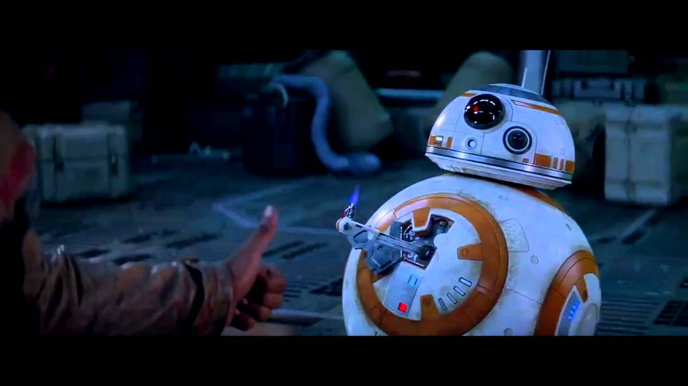

# Welcome to BB8!
This is the GitHub for the BallBot team for the 2026 Mechatronics program.

Contributors are:
Martin Johnson | Mechanical Design
Dante Rieger | IMU communication
Jonathan Pham | Control design
Ryan Stokes | Electrical design and motor control
Benedict Chandra | IMU Filter design

BB8 is proud of us guys.

Note that this repo is public now for tracking stuff.
